# 📊 Visual Git Commits Audit Report — Last Commits (`sumit-updates`)

**Repository:** `dealer-portal-quotation`  
**Branch:** `sumit-updates`  
**Author:** SURYA CHAUHAN  
**Date of Audit:** 06 October 2026  

---

## 🗺️ High-Level Visual Overview of Changes

```mermaid
graph TD
    subgraph Commit_3a8ff5c6["1. Responsive Modals (Commit 3a8ff5c6)"]
        A1["❌ Pehle: Chhoti screen pe Save/Cancel button cut ho jate the"] --> B1["✅ Ab: Fixed Header + Internal Vertical Scroll + Sticky Footer"]
    end

    subgraph Commit_80e079a2["2. Crash Fix & Direct DB (Commit 80e079a2)"]
        A2["❌ Pehle: 'New Dealer' dabate hi ReferenceError crash"] --> B2["✅ Ab: Safe State Mapping + Direct Supabase Fallback"]
    end

    subgraph Commit_9c71653c["3. Staff Auth & RBAC (Commit 9c71653c)"]
        A3["❌ Pehle: +91 Phone se login fail & settings har kisi ko dikhti thi"] --> B3["✅ Ab: Dual Phone Regex (+91 & clean) + Admin Only Governance Settings"]
    end

    subgraph Commit_b8c27e8f["4. KPI Row & Pure UI Modal (Commit b8c27e8f)"]
        A4["❌ Pehle: 5 KPI cards & Browser Default alert()"] --> B4["✅ Ab: 6th 'Total Files' KPI Card + Light Theme Branded Delete Modal"]
    end

    subgraph Latest_Fix["5. 10-Digit Mobile Enforcement & Null Email (Latest)"]
        A5["❌ Pehle: Alphabets input hone de raha tha aur browser autofill / dummy email save ho raha tha"] --> B5["✅ Ab: Strictly 10 Numeric Digits inputMode + Null/Empty Optional Email + AutoComplete OFF"]
    end
```



---

## 📌 Executive Summary Table

| Scope / Commit | Timestamp (IST) | Commit / Fix Message | Visual Impact & Core Solution |
| :--- | :--- | :--- | :--- |
| **Latest Fix** | 06 Oct 2026, 12:06:00 | `fix(dealer): enforce strictly 10 numerical digits in mobile field, disable browser autofill, allow null email` | 📱 **10-Digit Numeric Enforcement & Clean Email:** Mobile field me alphabets/symbols block; sirf 10 digits allowed. Email blank hone par `null` save hoga, browser autofill disabled. |
| [`3a8ff5c6`](file:///e:/repos/dealer-portal-quotation/src/components/AdminPortal/AdminSettings.jsx) | 06 Oct 2026, 01:52:31 | `fix(admin): make dealer and account center modals responsive with internal vertical scroll` | 🖼️ **3-Tier Responsive Modal Layout:** Fixed Header + Scrollable Middle Form + Sticky Bottom Footer. Form buttons screen ke niche cut nahi honge. |
| [`80e079a2`](file:///e:/repos/dealer-portal-quotation/src/components/AdminPortal/AdminSettings.jsx) | 06 Oct 2026, 01:42:15 | `fix(admin): resolve New Dealer button reference error in Account Center and add direct Supabase fallback` | 🛡️ **Zero-Crash Account Center:** `ReferenceError` resolve hua aur serverless API down hone par direct Supabase DB fallback laga diya gaya. |
| [`9c71653c`](file:///e:/repos/dealer-portal-quotation/src/components/Navigation.jsx) | 06 Oct 2026, 01:14:30 | `fix(auth): fix staff creation & login credential verification, fix profile dropdown display for staff, remove account settings for dealer and staff` | 👤 **Clean Navbar & RBAC:** Staff profile info in top dropdown. Staff/Dealer ke menu se settings option gayab; sirf Super Admin ko Governance Settings ka access. |
| [`b8c27e8f`](file:///e:/repos/dealer-portal-quotation/src/components/AdminPortal/BusinessPerformance.jsx) | 06 Oct 2026, 00:43:38 | `feat(admin): add Total Files KPI card, pure UI light delete modal, auto-increment staff/dealer IDs, dynamic units & categories, fix audit logs crash, enforce cross-branch DB persistence` | 📈 **Total Files KPI Card & Light Theme Modal:** 6th KPI card add hua + Browser ke generic alert() ki jagah light theme styled delete/archive modal. |

---

## 🎨 Visual Breakdown & Wireframes

### 📱 10-Digit Mobile & Null Email Fix
**Files:** [`src/components/AdminPortal/DealerManagement.jsx`](file:///e:/repos/dealer-portal-quotation/src/components/AdminPortal/DealerManagement.jsx), [`src/components/AdminPortal/AdminSettings.jsx`](file:///e:/repos/dealer-portal-quotation/src/components/AdminPortal/AdminSettings.jsx), [`src/services/adminAccountService.js`](file:///e:/repos/dealer-portal-quotation/src/services/adminAccountService.js), [`src/services/dealerService.js`](file:///e:/repos/dealer-portal-quotation/src/services/dealerService.js)

```
┌────────────────────────────────────────────────────────────────────────────────────────┐
│ 📱 REGISTERED MOBILE & EMAIL INPUT BEHAVIOR                                            │
├────────────────────────────────────────────────────────────────────────────────────────┤
│                                                                                        │
│  [❌ PEHLE]                                      [✅ AB]                               │
│  ┌─────────────────────────────────────┐         ┌───────────────────────────────────┐ │
│  │ Registered Mobile *                 │         │ Registered Mobile *               │ │
│  │ [ fdfgdffgdf                      ] │         │ [ 9876543210                    ] │ │
│  │ (Alphabets allowed & no digit limit)│         │ (Only 0-9 allowed, max 10 digits) │ │
│  ├─────────────────────────────────────┤         ├───────────────────────────────────┤ │
│  │ Official Business Email (Optional)  │         │ Official Business Email (Optional)│ │
│  │ [ riddhitranspower@gmail.com      ] │         │ [                               ] │ │
│  │ (Chrome autofilled saved email)     │         │ (autoComplete='off', saved null)  │ │
│  └─────────────────────────────────────┘         └───────────────────────────────────┘ │
└────────────────────────────────────────────────────────────────────────────────────────┘
```

---

## 📋 Comprehensive Feature & Stability Matrix

| Dimension | Before (Purana Code) | After (Latest Changes) |
| :--- | :--- | :--- |
| **Mobile Input Validation** | User letters type kar sakta tha (`fdfgdffgdf`). | **Strictly Numeric:** `replace(/\D/g, '').slice(0, 10)` + `maxLength={10}` + `inputMode="numeric"`. Alphabets type hona impossible hai. |
| **Email Field Behavior** | Blank chhodne par Chrome saved email autofill karta tha ya dummy email `partner@sunvinedealer.in` save ho jata tha. | `autoComplete="off"` enabled aur blank chhodne par database me **`null`** store hota hai. |
| **Password Input Security** | `autoComplete` missing tha jisse Chrome login autofill trigger ho raha tha. | `autoComplete="new-password"` enabled. |
| **Modal Usability on Laptops/Mobiles** | Fixed heights ke karan action buttons viewport ke niche cut ho rahe the. | 3-tier layout: Fixed Header + Internal Vertical Scroll Body + Fixed Sticky Bottom Footer. |
| **Account Center Button Stability** | "New Dealer" click karte hi `ReferenceError: dealerListState` se crash hota tha. | `dealersList` state mapping aur regex extraction se 100% crash-free. |
| **Data Persistence** | Serverless API timeout hone par dealer data fail ho jata tha. | Direct Supabase Client Fallback with bcrypt password hashing. |
| **Staff Mobile Login** | `+91` prefix lage phone numbers login me mismatch ho rahe the. | Dual phone regex query (`cleanMobile` + `+91${cleanMobile}`). |
| **Role-Based Access Control** | Dealer/Staff profile dropdown se settings tabs access ho rahe the. | Settings drawer strictly admin-only; staff/dealer auto-redirected to dashboards. |
| **Business Analytics KPI** | Total files metric missing tha; sirf quotations count dikhta tha. | Real-time "Total Files" KPI card with live kW onboarded stats. |

---
*Report generated and updated directly in repository files.*
